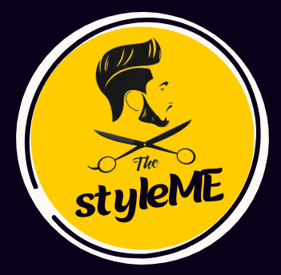

# **StyleMe** - Hair and Beard Style Recommendation System

   

## Overview

StyleMe is a final year project that aims to revolutionize the way people choose their hair and beard styles. The system uses a recommendation approach based on the user's face shape and gender, providing personalized suggestions for a perfect look.

## Problem Statement

- **Issue:** Deciding on a suitable hair or beard style without professional guidance is challenging.
- **Traditional Solutions:** Finding a stylist can be expensive and time-consuming.

## Research Gap

- **Existing Gap:** Currently, no system suggests hair and beard styles based on face shape and gender.
- **Innovation:** Utilizes CNN architectures like EfficientNet and RegNet for face shape prediction, demonstrating improved performance. Employs Ensemble method for better results. Introduces EfficientNet for gender identification.

## Aim

The primary goal of this research is to:

***The aim of this research is to design, develop, and evaluate a recommendation system that can analyze the face of a user and predict the face shape of the user. Then, according to 
the face shape, it will recommend the hair or beard style for the users***

## Technologies Used

- **Development Framework:** Flask
- **Machine Learning Models:** CNN for face shape and gender prediction
- **Additional Libraries:** OpenCV, NumPy, Pandas for image preprocessing and other tasks

